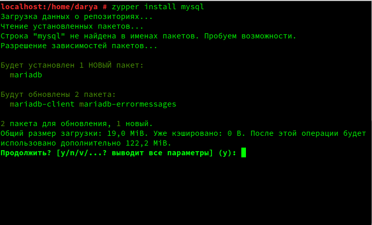
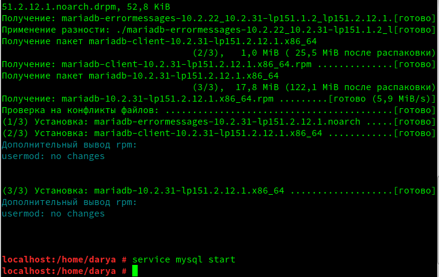
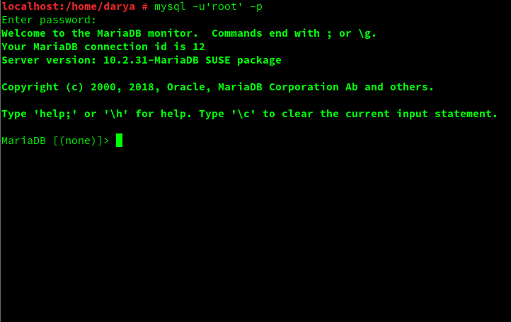
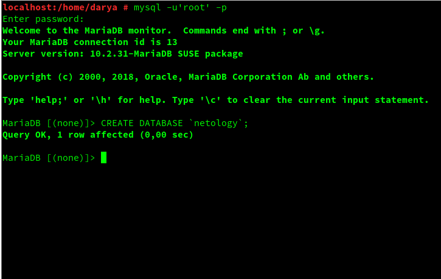
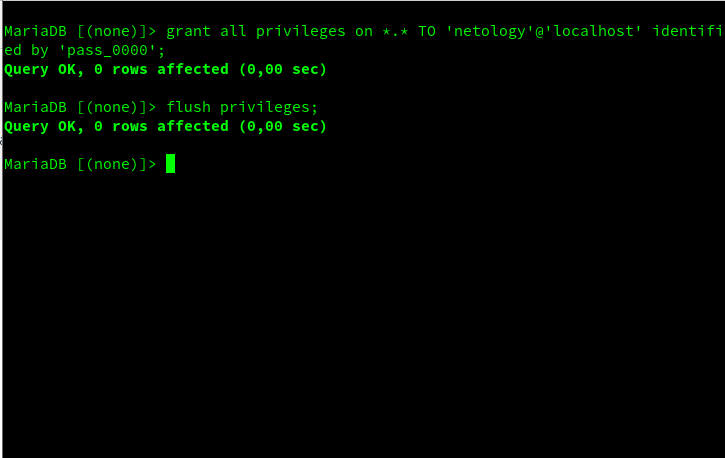

# Инструкция по установки MariaDB (mysql), операционная система OpenSUSE 15

## Установка mysql (mariadb) используя команду zypper

`zypper install mysql`

## Запуск mysql (mariadb)

`service mysql start`

## Выполнения авторизации за стандартным пользователем root

`mysql -u'root' -p`

## Создание базы банных (SQL запрос)

`CREATE DATABASE netology;`

## Добавление пользователя mysql и назначение ему прав над БД, и применение изменений

`GRANT ALL PRIVILEGES ON *.* TO 'netology'@'localhost' indentified by 'pass_0000';`
`FLUSH PRIVILEGES;`

## Проимпортировать схему в БД netology

`mysql -u'netology' -p'pass_0000' netology < schema.sql`

## Для повторных запусков приложения (SUT) использовать shell скрипт ./app-start.sh
